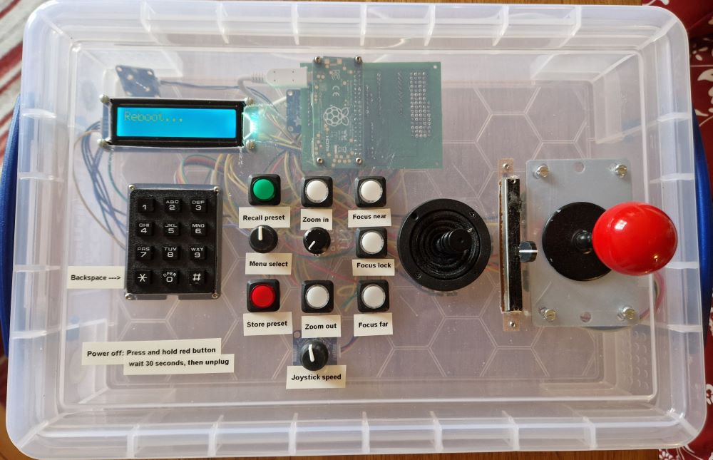
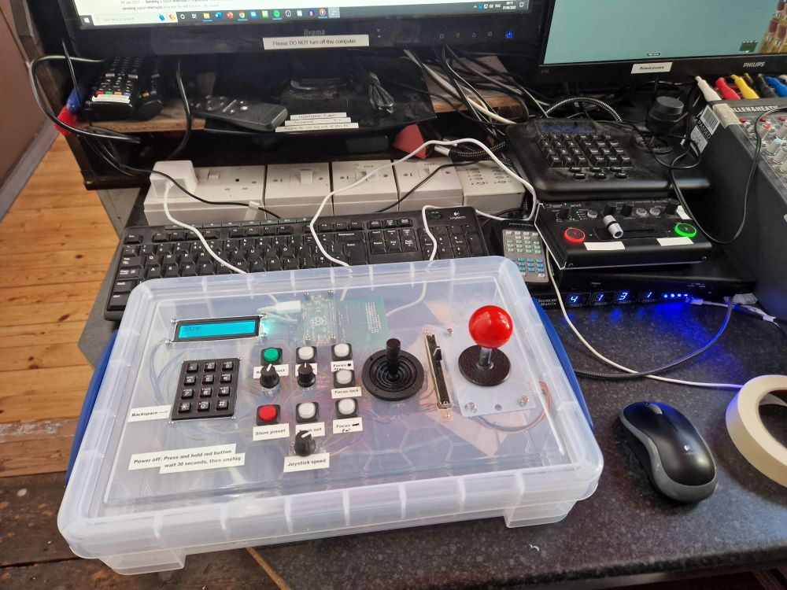
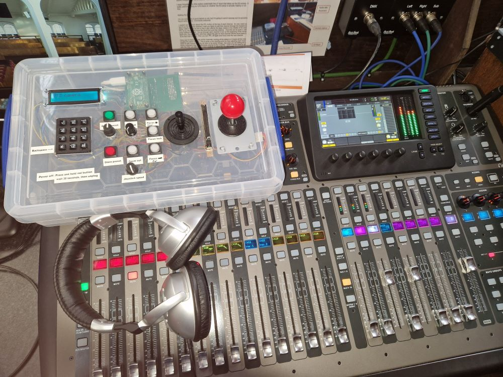

# ptz-joystick
Raspberry PI based controller for PTZ camera and two sound-desk channels

# Known Issues
Occasionally the PTZ camera seems to miss a stop command and the camera keeps
moving forever.  
